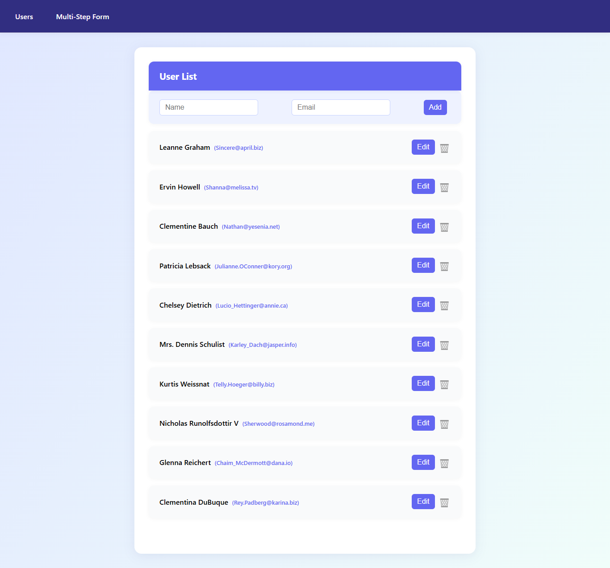

# React Assignment



This project is a professional React CRUD application with the following features:

- **User List**: Fetches initial data from an API, then persists all changes (add, edit, delete) locally.
- **Sticky Header & Loader**: Modern UI with sticky header and infinite scroll loader.
- **Add/Edit/Delete Users**: Fully functional CRUD, with all changes saved.
- **Multi-Step Form**: Validated user creation form, adding new users to the list.
- **Persistent Data**: All changes persist across page refreshes and navigation.
- **Responsive & Modern UI**: Built with best UX practices and a beautiful theme.

## Getting Started

1. Install dependencies:
   ```bash
   npm install
   ```
2. Start the development server:
   ```bash
   npm start
   ```

---

If you want to reset the user list, clear your browser's localStorage and refresh the page.

---

## Demo


---

Built with ❤️ using React, Redux Toolkit, and react-spinners.
